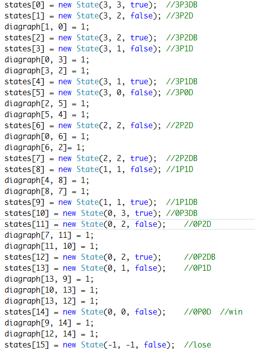
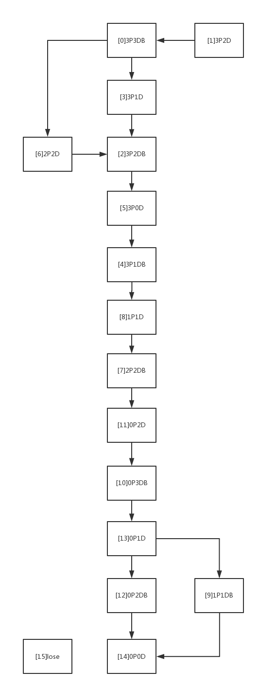

视频链接: https://pan.baidu.com/s/1VVFeDfeZ8WPPk6xYORNBTA 密码: 8r9p

添加的类：AIGameController（存储游戏状态和最佳路径）

FirstController中的Next方法用于自动进行游戏下一步。游戏状态在Go方法中更新。

AIGameController中用数组定义的最优路径图，diagraph[ i, j ] = 1表示有从状态i到状态j的路径。

所表示的最优路径如下：

