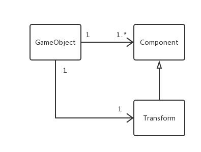
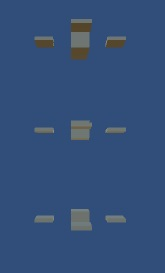
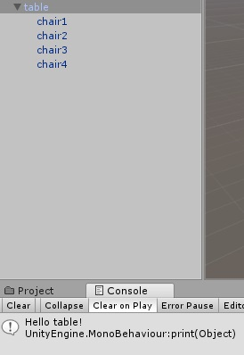

### 1、解释游戏对象（GameObjects）和资源（Assets）的区别与联系。

- 游戏对象：包括各种物体、摄像机、灯光、音频、UI元素、粒子系统等，是我们在游戏过程中看到的各种实体。它们自身有属性、组件、行为等。
- 资源：包括对象、材质、场景、声音、预设、贴图、脚本、动作等，是编写游戏时在内部生成的或从外部导入的素材，可以实例化为游戏对象，或者添加为游戏对象的一部分。
- 联系：游戏对象可以导出为资源；资源可以实例化为游戏对象，或者添加为游戏对象的一部分。
- 区别：游戏对象是我们在游戏过程中看到的各种实体；资源是编写游戏时在内部生成的或从外部导入的素材。


### 2、下载几个游戏案例，分别总结资源、对象组织的结构（指资源的目录组织结构与游戏对象树的层次结构）

资源结构位于Project Window，由文件夹组成，文件夹下还可划分为多个子文件夹，文件夹里存放脚本、预设等资源；

对象组织结构位于Hierarchy Window，包含了场景，场景下可包含多个游戏对象，游戏对象又可包含多个子对象。


### 3、编写一个代码，使用 debug 语句来验证MonoBehaviour基本行为或事件触发的条件

> 基本行为包括 Awake() Start() Update() FixedUpdate() LateUpdate()
>
> 常用事件包括 OnGUI() OnDisable() OnEnable()

```c#
using System.Collections;
using System.Collections.Generic;
using UnityEngine;

public class TableBeh : MonoBehaviour {
	// Use this for initialization
	void Start () {
		Debug.Log ("Start!");
	}
	
	// Update is called once per frame
	void Update () {
		Debug.Log ("Update!");
	}

	void Awake () {
		Debug.Log ("Awake!");
	}

	void FixedUpdate () {
		Debug.Log ("Fixed update!");
	}

	void LateUpdate () {
		Debug.Log ("Late update!");
	}

	void OnGUI () {
		Debug.Log ("GUI!");
	}

	void OnDisable () {
		Debug.Log ("Disabled!");
	}

	void OnEnable () {
		Debug.Log ("Enabled!");
	}
}
```


### 4、查找脚本手册，了解GameObject，Transform，Component 对象

#### （1）分别翻译官方对三个对象的描述（Description）

- GameObject是Unity里的基本对象，可以指代角色、道具、场景等。它们本身并不实现很多功能，但是它们可以作为容器存放组件，通过这些组件实现真实的功能。
- Transform存储一个游戏对象的位置、旋转度、大小等参数。每个GameObject都会有一个Transform组件。
- Component是游戏中联系对象和行为的螺母和螺栓，是游戏对象的功能性组件。

#### （2）描述下图中 table 对象（实体）的属性、table 的 Transform 的属性、 table 的部件

- table对象的属性
  - activeSelf属性：true
  - Tag属性：Untagged
  - Layer属性：Default
  - static属性：nothing
- table 的 Transform 的属性
  - 位置：x=0, y=0, z=0
  - 旋转度：x=0（表示围绕x轴旋转0度，旋转的正方向与x轴指向的关系形如左手做竖大拇指的姿势时，四指弯曲方向与大拇指指向的关系），y=0, z=0
  - 大小：x=1, y=1, z=1
- table的部件
  - Transform
  - Mesh Filter
  - Box Collider
  - Mesh Renderer

#### （3）用 UML 图描述 三者的关系（请使用 UMLet 14.1.1 stand-alone版本出图）




### 5、整理相关学习资料，编写简单代码验证以下技术的实现：

#### （1）查找对象

- 通过名字查找

  ```c#
  public static GameObject Find(string name)
  ```

- 通过标签查找单个对象

  ```c#
  public static GameObject FindWithTag(string tag)
  ```

- 通过标签查找多个对象

  ```c#
  public static GameObject[] FindGameObjectsWithTag(string tag)
  ```

#### （2）添加子对象

```c#
public static GameObject CreatePrimitive(PrimitiveType typename)
```

#### （3）遍历对象树

```c#
foreach (Transform child in transform) {
  //...
}
```

#### （4）清除所有子对象

```c#
foreach (Transform child in transform) { 
  Destroy(child.gameObject);
}
```


### 6、资源预设（Prefabs）与 对象克隆 (clone)

#### （1）预设（Prefabs）有什么好处？

​	一个预设体是一系列特定组件和属性的集合体，可实例化游戏对象。

​	可以把预设体看做一个模板，利用它可以重复创建具有相同结构的游戏对象。

​	对预设进行修改后，所有的游戏对象都会发生改变。

#### （2）预设与对象克隆 (clone or copy or Instantiate of Unity Object) 关系？

- 相同点：都可以制作出多个相同的游戏对象
- 不同点：预设是模板，修改预设就可以修改由它生成的所有的实例；对象克隆后，复制体和原体没有关系，互不影响

#### （3）制作 table 预制，写一段代码将 table 预制资源实例化成游戏对象

```c#
public class PrefabTry : MonoBehaviour {

	// Use this for initialization
	void Start () {
		GameObject instance = (GameObject)Resources.Load("Prefabs/TableSet");
		for (int i = 1; i < 3; i++) {
			Instantiate(instance, new Vector3(0,-5*i,0) , Quaternion.identity);
		}
	}
}
```




### 7、尝试解释组合模式（Composite Pattern / 一种设计模式）

> 使用 BroadcastMessage() 方法向子对象发送消息

- 组合模式：可以将对象组合成树形结构，以表示“部分-整体”的层次结构，使得用户对单个对象和组合对象的使用具有一致性。用户可以像处理简单元素一样来处理复杂元素。

- 代码

  ```c#
  //父对象
  public class TableSetBeh : MonoBehaviour {
  	// Use this for initialization
  	void Start () {
  		this.BroadcastMessage ("hello");
  	}
  }
  ```

  ```c#
  //子对象
  public class Chair1Beh : MonoBehaviour {
  	void hello() {
  		print ("Hello table!");
  	}
  }
  ```

  