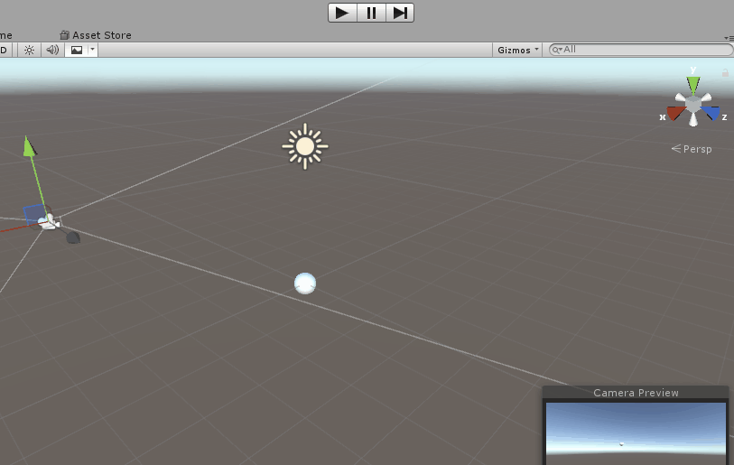
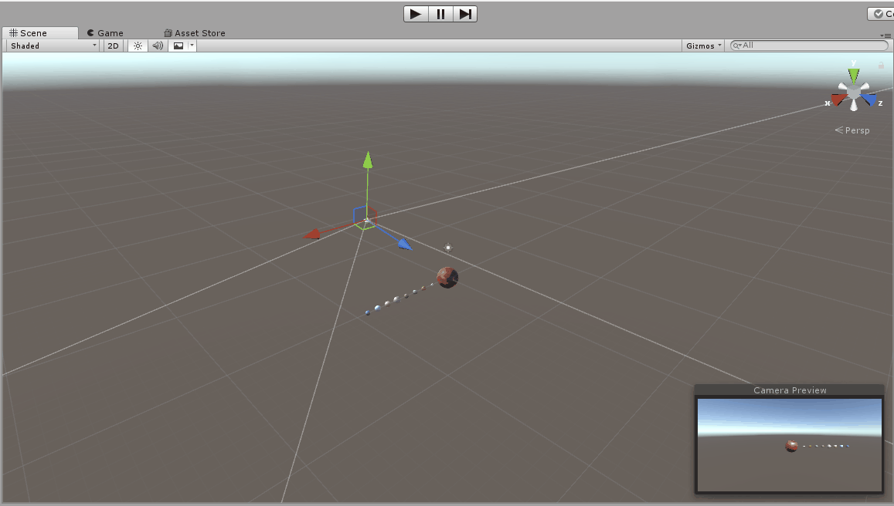

### 1、简答并用程序验证

#### （1）游戏对象运动的本质是什么？

本质是游戏对象在每一帧发生了坐标和旋转度的改变。

#### （2）请用三种以上的方法，实现物体的抛物线运动。（如，修改Transform属性，使用向量Vector3的方法…）

```c#
//把新的向量赋给transform.position
void Update () {
    var x = this.transform.position.x;
    x += Time.deltaTime;
    var y = 4 * x - x * x;
    this.transform.position = new Vector3 (x, y, 0);
}

//给transform.position一个增量
void Update () {
    var t = Time.deltaTime;
	var x = this.transform.position.x;
	var y = 4 * t - t * (2 * x + t);
	this.transform.position += new Vector3 (t, y, 0);
}

//使用transform的Translate方法
void Update () {
    var t = Time.deltaTime;
	var x = this.transform.position.x;
	var y = 4 * t - t * (2 * x + t);
	this.transform.Translate (new Vector3 (t, y, 0));
}

//使用Vector3的MoveTowards方法
void Update () {
		var x = this.transform.position.x;
		x += Time.deltaTime;
		var y = 4 * x - x * x;
		this.transform.position = Vector3.MoveTowards (this.transform.position, new Vector3(x, y, 0), 10);
}

```

效果图如下：（抛物线方程为 y = 4 * x -  x ^ 2 ）




#### （3）写一个程序，实现一个完整的太阳系， 其他星球围绕太阳的转速必须不一样，且不在一个法平面上。

```c#
//挂载到每个星球上
public class Rotate : MonoBehaviour {
	
	public Transform origin;  	//太阳
	public float speedRotate;	//公转速度
	public float speedRotateAround;		//自转速度
	Vector3 axisRotateAround; 	//公转轴

	void Start () {
		float rx, ry, rz;			//自转轴参数
		float rax, ray;				//公转轴参数
      
		speedRotateAround = Random.Range (10, 40);
		speedRotate = Random.Range (80, 120);
      
		rx = Random.Range(5, 90);  
		ry = Random.Range(5, 90); 
		rz = Random.Range(5, 90); 
		this.transform.Rotate (new Vector3 (rx, ry, rz));	//自转轴
		
		rax = Random.Range (10, 20);
		ray = rax * Random.Range (2, 5);
		axisRotateAround = new Vector3(rax, ray, 0);	//公转轴
      
      	//从太阳到行星的距离
		float distance = Vector3.Magnitude (this.transform.position);
      	//将行星放置到垂直于公转轴且过太阳中心的法平面
		this.transform.position = Vector3.ClampMagnitude (new Vector3 (ray, -rax, 0), distance);
	}  
  
	void Update () {  
      	//公转
		this.transform.RotateAround(origin.position, axisRotateAround, speedRotateAround * Time.deltaTime);  
      	//自转
		this.transform.Rotate (this.transform.up, speedRotate * Time.deltaTime);
	}  
}
```




### 2、编程实践

- 阅读以下游戏脚本

> Priests and Devils
>
> Priests and Devils is a puzzle game in which you will help the Priests and Devils to cross the river within the time limit. There are 3 priests and 3 devils at one side of the river. They all want to get to the other side of this river, but there is only one boat and this boat can only carry two persons each time. And there must be one person steering the boat from one side to the other side. In the flash game, you can click on them to move them and click the go button to move the boat to the other direction. If the priests are out numbered by the devils on either side of the river, they get killed and the game is over. You can try it in many > ways. Keep all priests alive! Good luck!

程序需要满足的要求：

- play the game ( http://www.flash-game.net/game/2535/priests-and-devils.html )
- 列出游戏中提及的事物（Objects）
- 用表格列出玩家动作表（规则表），注意，动作越少越好
- 请将游戏中对象做成预制
- 在 GenGameObjects 中创建 长方形、正方形、球 及其色彩代表游戏中的对象。
- 使用 C# 集合类型 有效组织对象
- 整个游戏仅 主摄像机 和 一个 Empty 对象， **其他对象必须代码动态生成！！！** 。 整个游戏不许出现 Find 游戏对象， SendMessage 这类突破程序结构的 通讯耦合 语句。 **违背本条准则，不给分**
- 请使用课件架构图编程，**不接受非 MVC 结构程序**
- 注意细节，例如：船未靠岸，牧师与魔鬼上下船运动中，均不能接受用户事件！


游戏中提及的事物：

- 3个牧师
- 3个魔鬼
- 船
- 河
- 河岸

玩家动作表：

| 船已经靠岸时，且游戏角色没有移动     |
| -------------------- |
| 使船中的角色上岸             |
| 使船旁边的河岸上的角色下船（船内未满员） |
| 开船                   |

​代码见Week4_game。